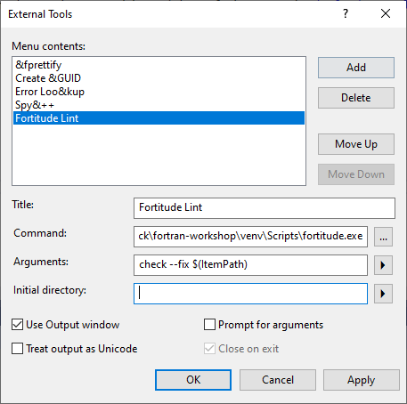

# README for Visual Studio

## Setup

Requirements:

- Visual Studio, with the "Desktop development with C++" installed
- Intel oneAPI Fortran Essentials [Download here](https://www.intel.com/content/www/us/en/developer/tools/oneapi/fortran-compiler-download.html)
- Make sure the oneAPI bin folder is in your `PATH` environment variable (e.g. `C:\Program Files (x86)\Intel\oneAPI\compiler\latest\bin`)

## Getting started

Open the folder where you cloned this project to in Visual Studio (in the `Start window` select `Open local folder...`).

Visual Studio should automatically run the CMake configuration step. You can see this happening in the `Output` panel.

When done, you can start either `hello-world` or `fortran-workshop-tester` from the menu bar and run or debug either of them. In the `Solution Explorer` you can switch to the `CMake Targets View` to select, build or debug specific targets.

## Fortitude lint

To run the Fortitude linter, open a Terminal and run:

```
.\venv\Scripts\fortitude.exe check --fix src test
```

You can also define it as an "External Tool" via `Tools` - `External Tools`:


